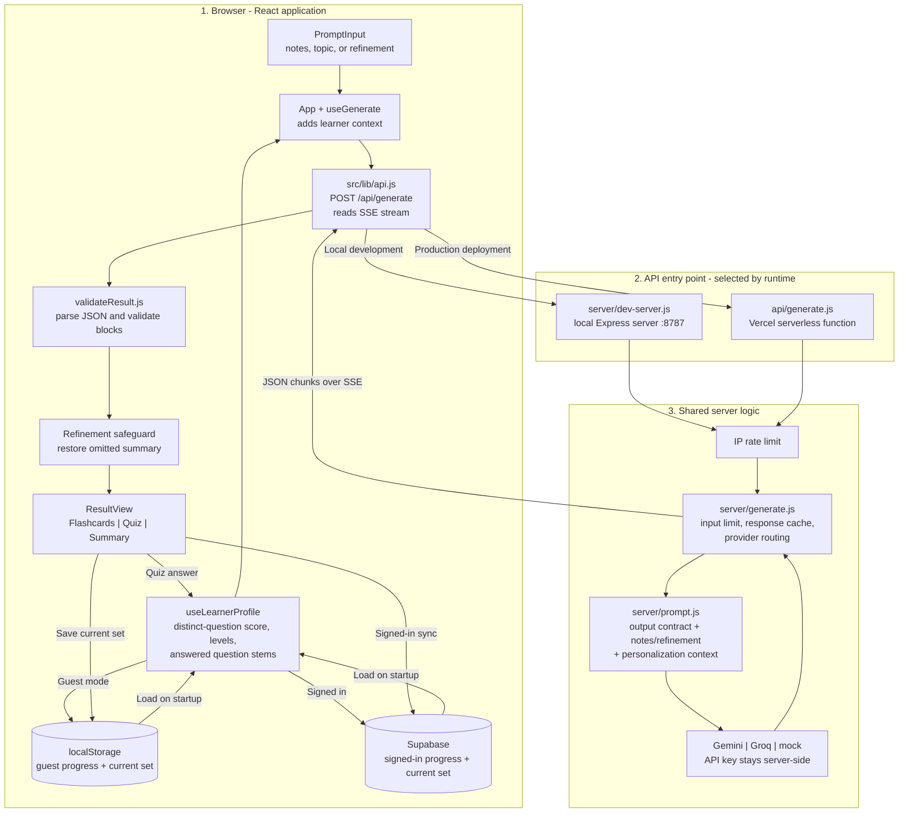

# Recall - AI Study Assistant

Recall turns study notes or a topic into an interactive study set: flashcards, multiple-choice questions, explanations, and a summary. It tracks quiz performance by topic and uses that history to adapt future study sets.

- **Assignment:** Flam Frontend Internship - AI-powered study assistant
- **Production URL:** [https://quizapp-ruddy-two.vercel.app/](https://quizapp-ruddy-two.vercel.app/)
- **Hosting:** Vercel
- **Demo Link:** https://1drv.ms/v/c/6faea21805be5207/IQBaZCBgm-Y4RJRQy9Qz-c9KAULMsL-fzukCKzTyzQbF520?e=N2nTKU

> Before sharing the production URL, confirm that Vercel Deployment Protection allows reviewers to open it without team approval.

## Generated study-set format

The model returns JSON with a title and a list of typed blocks. Recall validates each block before displaying it.

```json
{
  "title": "Photosynthesis",
  "blocks": [
    {
      "type": "flashcard",
      "id": "c1",
      "topic": "Light reactions",
      "difficulty": "easy",
      "question": "Where do the light reactions happen?",
      "answer": "They happen in the thylakoid membranes inside chloroplasts."
    },
    {
      "type": "mcq",
      "id": "q1",
      "topic": "Calvin cycle",
      "difficulty": "medium",
      "question": "Which molecule is fixed during the Calvin cycle?",
      "options": ["Oxygen", "Carbon dioxide", "Nitrogen", "Water"],
      "correctIndex": 1,
      "explanation": "Carbon dioxide supplies the carbon used to build sugar.",
      "optionFeedback": [
        "Oxygen is released in the light reactions, not fixed here.",
        "",
        "Nitrogen fixation is a separate process.",
        "Water is split during the light reactions."
      ]
    },
    { "type": "summary", "id": "s1", "points": ["Key idea one", "Key idea two"] }
  ]
}
```

## Features

- Generate a study set from pasted notes or a topic.
- Review flip-card decks and answer multiple-choice quizzes.
- See explanations for correct answers and option-specific feedback for wrong choices.
- Re-test questions answered incorrectly.
- Refine a set with natural-language instructions and undo the last refinement.
- Track progress by subject and topic in the learning dashboard.
- Generate an additional study set focused on the learner's lowest-scoring topics.
- Adapt future question difficulty and explanation depth to quiz performance.
- Avoid giving repeated answers extra weight in the confidence score.
- Schedule missed questions for review and space successful reviews over time.
- Save the current study set, export or import it as JSON, and use dark mode.
- Use the responsive layout and keyboard controls for flashcards and quizzes.
- Use guest mode with browser storage, or optionally sign in with email and password to sync progress across devices.

## System architecture




## How personalization works

Recall does not ask learners to enter a confidence rating. It estimates confidence from their performance on distinct quiz questions for each topic.

- An exact question contributes once to a topic's score. Re-answering it updates that question's latest outcome; it does not add another attempt or correct answer.
- A topic stays at **Beginner** until there are at least 3 distinct answered questions. It can reach **Advanced** only after at least 5.
- Once those minimums are met, accuracy below 40% maps to Beginner, 40-74% to Intermediate, and 75% or higher to Advanced.
- The learner's topic levels are sent with generation and refinement requests. Low-confidence topics receive easy, fundamentals-first questions and 4-6 sentence flashcard answers and quiz explanations. Intermediate topics receive mostly medium questions; advanced topics receive medium or hard application questions. Wrong-choice feedback is prompted at 3-5 plain-language sentences at every level.
- Up to 12 previously answered question stems per topic are supplied as anti-repeat guidance for newly generated questions. The model is asked to avoid repeating or lightly rewording them. AI output can vary, but repeating an exact question does not increase its confidence score.
- The dashboard reports distinct-question accuracy and shows each topic's current level.

Missed questions are scheduled for review after 10 minutes. Correct reviews move through 1, 3, 7, 14, and 30 day intervals. Learners can also reset their progress from the dashboard.

## Refine behavior

**Refine the current set** sends the current study set and the requested change to the model. The model is instructed to return the complete updated set, preserve unchanged blocks and questions, and modify only what the request calls for. For example, asking for longer answers should leave the questions alone; asking for harder questions should change the quiz difficulty or question content. The previous set is available through **Undo last refine**. If the model omits the existing summary, Recall restores it unless the instruction explicitly asks to remove, delete, drop, or omit the summary.


`optionFeedback` has one entry per answer choice. Its entry for the correct answer is an empty string; each wrong-choice entry explains that distractor. The full prompt and validation rules are in [`server/prompt.js`](server/prompt.js) and [`src/lib/validateResult.js`](src/lib/validateResult.js).

## Validation and error handling

- The response is parsed as JSON and validated by block type before it reaches the study UI. A Markdown JSON fence is stripped if the model adds one.
- Invalid blocks are skipped individually so one malformed card does not discard valid cards. Recall shows a notice with the number skipped. If no valid block remains, it shows an error and retry action.
- Empty or malformed responses, provider/network errors, rate limits, oversized input, and timeouts produce user-facing error states. Provider details and keys are not sent to the browser.
- A slow-request message appears after 6 seconds; requests are aborted after 30 seconds. Starting another request aborts the previous one so an older response cannot replace newer content.
- The response simulator at `?debug=1` exercises malformed, wrong-shape, empty, slow, and failed responses.


### Request and response steps

1. **Collect the study request.** The learner enters notes or a topic. A refinement also includes the current complete study set and the requested edit.
2. **Attach personalization.** The app adds the learner's per-topic accuracy levels and up to 12 previously answered question stems per topic when progress is available.
3. **Send the request to Recall's API.** `src/lib/api.js` posts to `/api/generate` and reads a Server-Sent Events (SSE) response. The browser never calls Gemini or Groq directly.
4. **Choose the runtime route.** Local development uses `server/dev-server.js`; Vercel uses `api/generate.js`. Both use the same server logic in `server/generate.js`.
5. **Prepare the model request.** The server applies the input limit, rate limit, and response cache, then `server/prompt.js` builds the JSON contract and combines the notes or refinement with the learner context.
6. **Call the provider.** The server sends the prompt to Gemini, Groq, or the fixed mock provider using server-side environment variables. Provider output streams back through the API route.
7. **Validate before display.** The browser parses the complete response and validates blocks individually. Invalid blocks are skipped; if none remain valid, Recall shows an error and retry action. For refinements, a safeguard restores the previous summary if it was omitted and the learner did not ask to remove it.
8. **Render and save the study set.** `ResultView` displays the flashcards, quiz, and summary. The current set is saved to localStorage and, when signed in, synced to Supabase.
9. **Update learning progress.** Quiz answers update the latest result for that distinct topic/question, maintain the review schedule, and recalculate levels. Guest progress is stored locally; signed-in progress is stored in Supabase. Future requests use the updated context.

The API limits input to 20,000 characters, allows up to 20 requests per IP each minute, and caches matching requests in memory for five minutes. Provider keys stay on the server, and provider error details are not exposed to the browser. The prompt contract is defined in [`server/prompt.js`](server/prompt.js); response validation is implemented in [`src/lib/validateResult.js`](src/lib/validateResult.js).

## Keyboard controls

| Key | Action |
| --- | --- |
| `Space` or `Enter` | Flip the current flashcard |
| `Left` / `Right` arrows | Move between flashcards |
| `1`-`4` | Choose a quiz option |

## Tests and production build

```bash
npm test
npm run build
```

The tests cover UI interactions, learner scoring and anti-repeat history, spaced review scheduling, provider handling, response validation, and refinement summary preservation.

## Project structure

```text
api/                    Vercel serverless API entry point
server/                 Prompt construction, provider calls, mock provider, local API server
shared/                 Shared input limits
src/components/         Study UI, authentication, quiz, dashboard, review queue
src/hooks/               Generation, auth, cloud session, and learner profile state
src/lib/                 API client, validation, storage, scoring, and review logic
supabase/                Database schema and migrations
tests/                   Component and logic tests
.env.example             Local configuration template
README.md
```

## Run locally

### Requirements

- Node.js 20.19+ or 22.12+
- npm

### Install and start

```bash
npm install
```

Copy `.env.example` to `.env`, then start the client and API server together:

```bash
# macOS / Linux
cp .env.example .env
npm start
```

```powershell
# Windows PowerShell
Copy-Item .env.example .env
npm start
```

Open [http://localhost:5173](http://localhost:5173). The API server runs at `http://localhost:8787`; its local health endpoint is `/api/health`.

By default the app uses the built-in mock provider, so it can run without an LLM key. The mock provider returns fixed sample study content; use a real provider to generate material from arbitrary notes.

### Configure an LLM provider

Add the provider settings to `.env`:

```dotenv
LLM_PROVIDER=gemini
LLM_API_KEY=your-gemini-api-key
LLM_MODEL=gemini-2.0-flash
PORT=8787
```

Supported providers are `gemini`, `groq`, and `mock`. For Groq, for example:

```dotenv
LLM_PROVIDER=groq
LLM_API_KEY=your-groq-api-key
LLM_MODEL=llama-3.3-70b-versatile
```

Keep `LLM_API_KEY` on the server. Do not rename it with a `VITE_` prefix or commit a real key.

### Debug response states

Open `http://localhost:5173/?debug=1` to show the development-only response simulator. It can return malformed JSON, the wrong shape, an empty response, a slow response, or a provider failure to exercise the UI's loading, validation, and retry states.

## Optional accounts and cloud sync

Without Supabase settings, Recall runs in guest mode. The current study set and learner history are stored in that browser's `localStorage`.

To enable email/password accounts and cross-device sync:

1. Create a Supabase project.
2. Run [`supabase/schema.sql`](supabase/schema.sql) in the project's SQL editor.
3. Add the following frontend build variables to `.env`:

   ```dotenv
   VITE_SUPABASE_URL=https://your-project.supabase.co
   VITE_SUPABASE_ANON_KEY=your-supabase-anon-key
   ```

4. Enable email/password sign-in in Supabase Auth and configure the site's redirect URLs for localhost and the production origin.

The app supports account creation, sign-in, password reset, and sign-out. If email confirmation is enabled in Supabase, new accounts must confirm their email before signing in. Signed-in users sync topic history, scheduled reviews, and the current study set. Supabase Row Level Security policies restrict user data to its owner. The anon key is intended for browser use; never expose the LLM provider key.

For an existing database created before subject-wise progress was added, run [`supabase/migrations/20260925_learner_topic_subjects.sql`](supabase/migrations/20260925_learner_topic_subjects.sql) after the base schema.

## Deploy to Vercel

The repository includes a serverless API entry point at `api/generate.js`; Vercel routes `/api/generate` to it. Configure these project environment variables in Vercel:

- `LLM_PROVIDER`
- `LLM_API_KEY`
- `LLM_MODEL` (optional; the server has provider defaults)
- `VITE_SUPABASE_URL` and `VITE_SUPABASE_ANON_KEY` if using Supabase

Redeploy after changing environment variables. Set Supabase Auth's Site URL and allowed redirect URLs to the public production origin. Make the reviewed deployment accessible to reviewers; protected preview deployments can require Vercel team approval.

## Known limitations

- LLM output is probabilistic. Anti-repeat instructions guide the provider but cannot guarantee semantic uniqueness; exact repeated questions are prevented from adding duplicate confidence credit.
- The mock provider uses fixed sample content and is for UI development, not arbitrary-topic generation.
- Guest data belongs to one browser. Sign in to sync it through Supabase.
- The API response cache and rate limiter are in-memory and reset when the server process restarts.
- LLM availability and rate limits depend on the provider account and its current plan.
